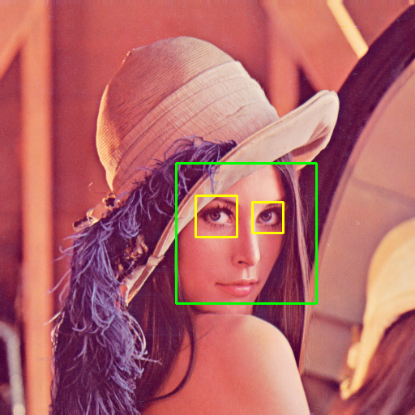

# Face Detection Using Hear Cascade Classifiers

##### What is face detection?

Object detection is one of the computer technologies that is connected to image processing and computer vision. It is concerned with detecting instances of an object such as human faces, buildings, trees, cars, etc. The primary aim of face detection algorithms is to determine whether there is any face in an image or not.

In recent years, we have seen significant advancement of technologies that can detect and recognise faces. Our mobile cameras are often equipped with such technology where we can see a box around the faces. Although there are quite advanced face detection algorithms, especially with the introduction of deep learning, the introduction of viola jones algorithm in 2001 was a breakthrough in this field. Now let us explore the viola jones algorithm in detail.

##### What is Viola Jones algorithm?

Viola Jones algorithm is named after two computer vision researchers who proposed the method in 2001, Paul Viola and Michael Jones in their paper, “Rapid Object Detection using a Boosted Cascade of Simple Features”. Despite being an outdated framework, Viola-Jones is quite powerful, and its application has proven to be exceptionally notable in real-time face detection. This algorithm is painfully slow to train but can detect faces in real-time with impressive speed.

Given an image(this algorithm works on grayscale image), the algorithm looks at many smaller subregions and tries to find a face by looking for specific features in each subregion. It needs to check many different positions and scales because an image can contain many faces of various sizes. Viola and Jones used Haar-like features to detect faces in this algorithm.

The Viola Jones algorithm has four main steps, which we shall discuss in the sections to follow:

1. Selecting Haar-like features
2. Creating an integral image
3. Running AdaBoost training
4. Creating classifier cascades

For more details you can visit :
[Object Detection](https://stackabuse.com/object-detection-with-opencv-python-using-a-haar-cascade-classifier/) and [The Integral Image](https://levelup.gitconnected.com/the-integral-image-4df3df5dce35)

For all haarcascades algorithms [opencv-haarcascades](https://github.com/opencv/opencv/tree/master/data/haarcascades)
